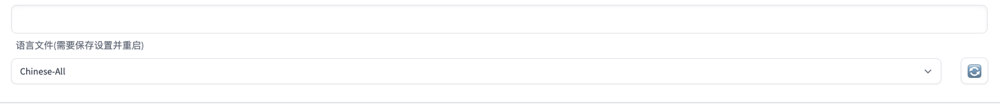

Stable-Diffusion WEBUI 汉化
================================================================================

WEBUI 汉化
--------------------------------------------------------------------------------

1. 从 `Stable-Diffusion 汉化文件 <https://github.com/VinsonLaro/stable-diffusion-webui-chinese/tree/main/localizations>`_ 下载汉化文件，任选一个 json 文件都可以。
#. 将下载的 Json 文件放置到路径 stable-diffusion-webui/localizations

#. 打开 SD 设置里面用户界面设置, 选择汉化文件名，保存设置

4. Reload UI 使汉化生效

