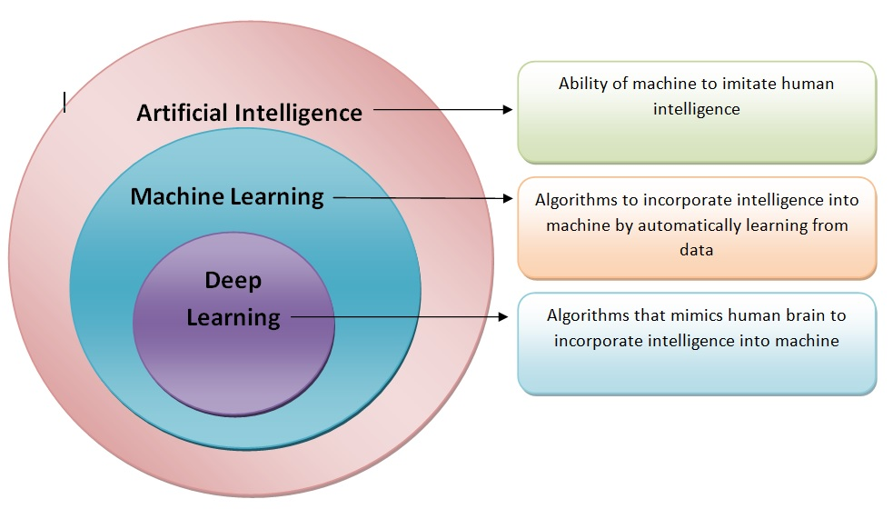

# 优化理论

# 机器学习
人工智能（Artificial intelligence）是研究、开发用于模拟、延伸和扩展人的智能的理论、方法、技术及应用系统的一门新的技术科学。它是一个笼统而宽泛的概念，人工智能的最终目标是使计算机能够模拟人的思维方式和行为。

机器学习（Machine learning）是人工智能的子集，是实现人工智能的一种途径，但并不是唯一的途径。它是一门专门研究计算机怎样模拟或实现人类的学习行为，以获取新的知识或技能，重新组织已有的知识结构使之不断改善自身的性能的学科。大概在上世纪80年代开始蓬勃发展，诞生了一大批数学统计相关的机器学习模型。

深度学习（Deep learning）是机器学习的子集，灵感来自人脑，由人工神经网络（ANN）组成，它模仿人脑中存在的相似结构。在深度学习中，学习是通过相互关联的「神经元」的一个深层的、多层的「网络」来进行的。「深度」一词通常指的是神经网络中隐藏层的数量。大概在2012年以后爆炸式增长，广泛应用在很多的场景中。

从实践的意义上来说，机器学习是在大数据的支撑下，通过各种算法让机器对数据进行深层次的统计分析以进行「自学」，使得人工智能系统获得了归纳推理和决策能力。

机器学习的三要素

- 数据: 数据驱动指的是我们基于客观的量化数据，通过主动数据的采集分析以支持决策。
- 模型: 在AI数据驱动的范畴内，模型指的是基于数据X做决策Y的假设函数，可以有不同的形态，计算型和规则型等。
- 算法: 指学习模型的具体计算方法。统计学习基于训练数据集，根据学习策略，从假设空间中选择最优模型，最后需要考虑用什么样的计算方法求解最优模型。通常是一个最优化的问题。

机器学习的核心技术

- 分类: 应用以分类数据进行模型训练，根据模型对新样本进行精准分类与预测。
- 聚类: 从海量数据中识别数据的相似性与差异性，并按照最大共同点聚合为多个类别。
- 异常检测: 对数据点的分布规律进行分析，识别与正常数据及差异较大的离群点
- 回归: 根据对已知属性值数据的训练，为模型寻找最佳拟合参数，基于模型预测新样本的输出值。

## 机器学习基本名词
- 示例/样本：数据集中的一条数据。
- 属性/特征：样本的某个维度，如「色泽」「根蒂」等。
- 属性空间/样本空间/输入空间X：由全部属性张成的空间。
- 特征向量：空间中每个点对应的一个坐标向量。
- 标记：关于示例结果的信息，如（（色泽=青绿，根蒂=蜷缩，敲声=浊响），好瓜），其中「好瓜」称为标记。
- 分类：若要预测的是离散值，如「好瓜」，「坏瓜」，此类学习任务称为分类。
- 假设：学得模型对应了关于数据的某种潜在规律。
- 真相：潜在规律自身。
- 学习过程：是为了找出或逼近真相。
- 泛化能力：学得模型适用于新样本的能力。一般来说，训练样本越大，越有可能通过学习来获得具有强泛化能力的模型。

## 机器学习的分类
- 监督学习（Supervised Learning）：从给定的训练数据集中学习出一个函数，当新的数据到来时，可以根据这个函数预测结果。监督学习的训练集要求是包括输入和输出，也可以说是特征和目标。训练集中的目标是由人标注的。常见的监督学习算法包括回归分析和统计分类。
- 无监督学习（Unsupervised Learning）：与监督学习相比，训练集没有人为标注的结果。常见的无监督学习算法有生成对抗网络（GAN）、聚类。
- 强化学习（Reinforcement Learning）：通过观察来学习做成如何的动作。每个动作都会对环境有所影响，学习对象根据观察到的周围环境的反馈来做出判断。

# 优化框架