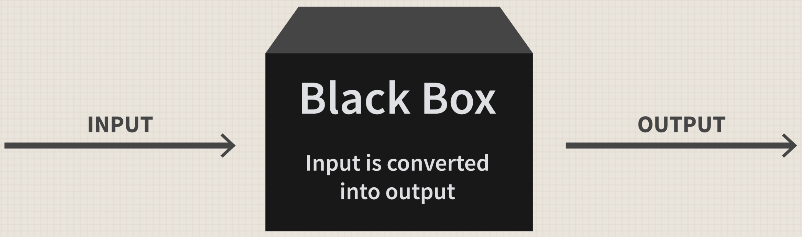

ML & AI 简明教程
================================================================================

.. Attention:: 本文写给美术和其他不需要理解 ML & AI 原理的同学，方便大家上手工作。

:ref:`优化理论`

参考资料
--------------------------------------------------------------------------------

- `台湾大学李宏毅机器学习课程 <https://www.bilibili.com/video/BV1TD4y137mP/?spm_id_from=333.337.search-card.all.click&vd_source=015433f45e547de773aee6dfd61f2ffa>`_
- `吴恩达机器学习课程 <https://www.bilibili.com/video/BV1Pa411X76s/?spm_id_from=333.337.search-card.all.click>`_
- `南京大学周志华机器学习课程 <https://www.bilibili.com/video/BV1R44y1o749/?spm_id_from=333.337.search-card.all.click&vd_source=015433f45e547de773aee6dfd61f2ffa>`_
