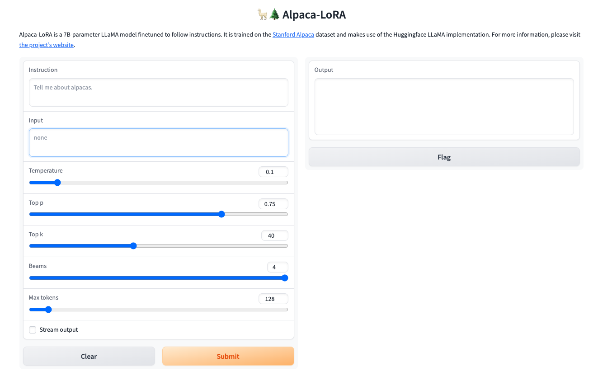

.. _Alpaca_LoRA:

Alpaca-LoRA
================================================================================

1. 安装

.. code:: bash

    git clone https://github.com/tloen/alpaca-lora.git
    
2. 下载模型

    - 基础大模型 `https://huggingface.co/decapoda-research/llama-7b-hf <https://huggingface.co/decapoda-research/llama-7b-hf>`_
    - LoRA 模型 `tloen/alpaca-lora-7b <https://huggingface.co/tloen/alpaca-lora-7b>`_

3. 运行

.. code:: bash

    python generate.py
    

