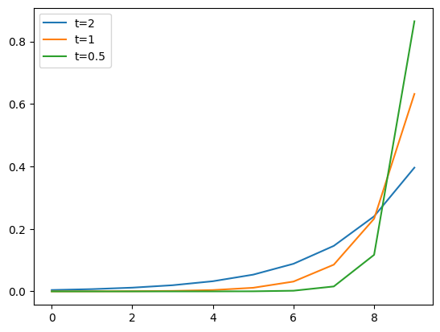

.. _通用超参数:

通用超参数的含义
================================================================================

Temperature
--------------------------------------------------------------------------------

Temperature 是一个超参数，可用于控制生成语言模型中生成文本的随机性和创造性。 它用于调整模型的softmax输出层中预测词的概率。

原始的 Softmax 函数

:math:`p(x_i) = \frac{e^{x_i}}{\sum_{j=1}^V e^{x_j}}`

加入 Temperater 参数 T 之后的 Softmax 函数

:math:`p(x_i) = \frac{e^{\frac{x_i}{T}}}{\sum_{j=1}^V e^{\frac{x_j}{T}}}` 

温度参数通常设置为 0.1 到 1.0 之间的值，具体取决于生成文本中所需的随机性和创造性水平。 温度值为 1.0 对应于标准 softmax 函数，其中预测词的概率未按比例缩放。

Top K & Top P
--------------------------------------------------------------------------------

自回归式的生成中，模型预测的生成序列 :math:`y` 的第 :math:`t` 个值 :math:`y_t` 往往是预测出一个概率分布 :math:`p(y_t)` 。

生成过程中采样（sampling) 过程即每一步都直接利用 :math:`p(y_t)` 采样生成的词。采样可以增加生成的多样性，但是概率分布的长尾也增加了生成句子不连贯的可能性。为了解决这一问题，top-k，top-p
等方法在采样前对 :math:`p(y_t)` 进行剪枝。

- Top-k sampling 的思路非常简单，就是在采样之前缩减采样空间，只保留概率最高的k个词，然后重新进行归一化得到新的概率分布。Top-k sampling能够在保持复杂度的情况下去除分布尾部的一些噪音，但是其最大的问题是设定单一的k无法适应各种分布的可能性。
- Top-p 提出根据分布的形状灵活地设定k，从概率最高的词开始构造采样空间，直到采样空间里所有词的概率加和超过阈值 :math:`p` 之后停止.