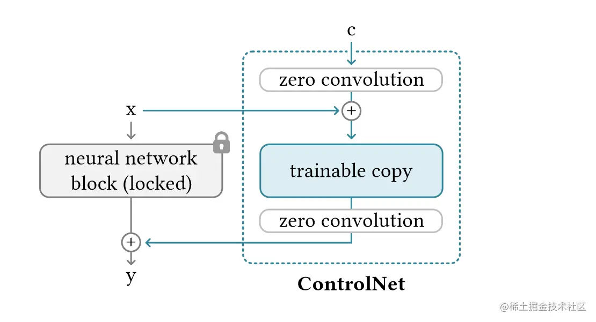
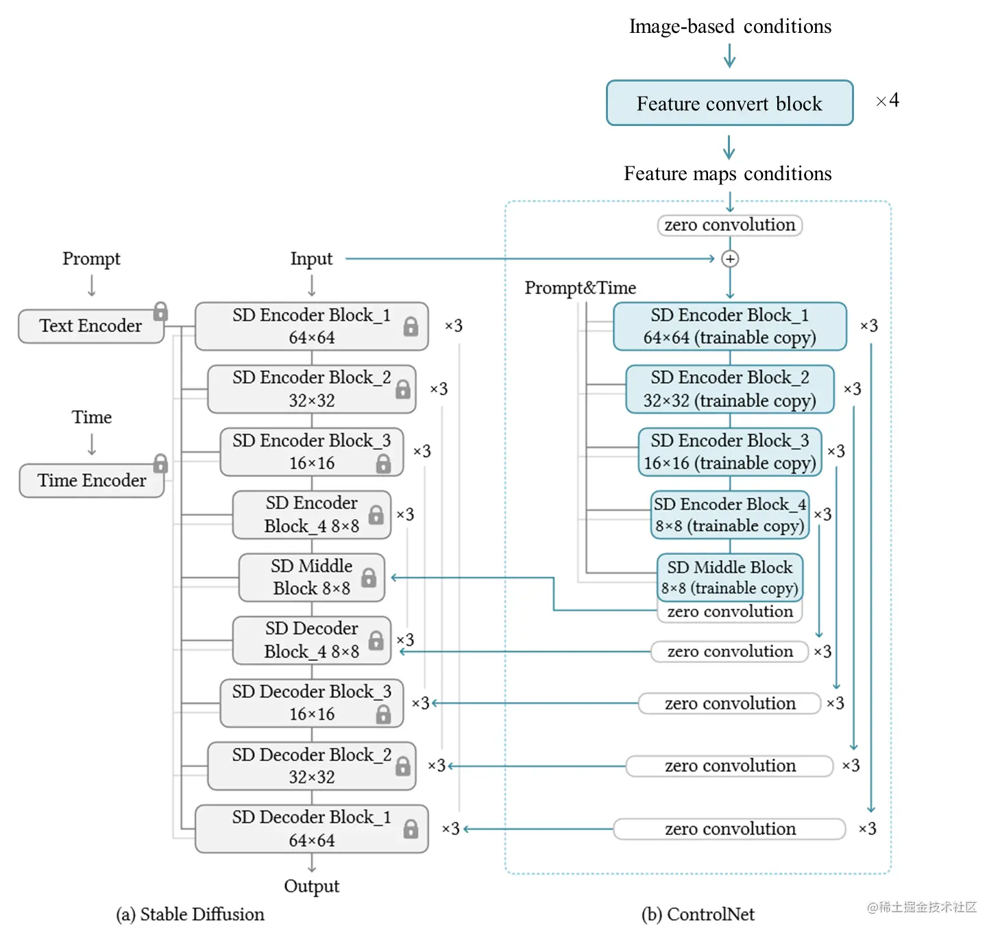

.. _ControlNet 原理:

ControlNet 原理
================================================================================

ControlNet 控制单个神经网络
--------------------------------------------------------------------------------

在一个扩散模型中，原始的神经网络 :math:`F` 输入 :math:`x` 获得 :math:`y` 参数用 :math:`\Theta` 表示。

:math:`y = \mathcal{F} (x; \Theta)`

ControlNet中，就是将模型原始的神经网络锁定，设为locked copy。然后将原始网络的模型复制一份，称之为trainable copy，在其上进行操作施加控制条件。然后将施加控制条件之后的结果和原来模型的结果相加获得最终的输出。经过这么一顿操作之后，施加控制条件之后，最后将原始网络的输出修改为：

:math:`y_c = \mathcal{F}(x: \Theta) + \mathbb{Z}(\mathcal{F}(x + \mathbb{Z}(c; \Theta_{z1}); \Theta_c); \Theta_{z2})`

初始化之后未经训练的ControlNet参数满足条件:

1. :math:`\mathbb{Z}(c; \Theta_{z1})=0`
#. :math:`\mathcal{F}(x + \mathbb{Z}(c; \Theta_{z1}); \Theta_c) = \mathcal{F}(x; \Theta_c) = \mathcal{F}(x; \Theta)`
#. :math:`\mathbb{Z}(\mathcal{F}(x + \mathbb{Z}(c; \Theta_{z1}); \Theta_c); \Theta_{z2})=\mathbb{Z}(\mathcal{F}(x; \Theta_c); \Theta_{z2}) = 0`

表明ControlNet未经训练的时候，输出为0，那加到原始网络上的数字也是0。这样对原始网络是没有任何影响。之后ControlNet训练也只是在原始网络上进行优化，这样可以认为和微调网络是一样的。

扩展模型中使用 ControlNet
--------------------------------------------------------------------------------

