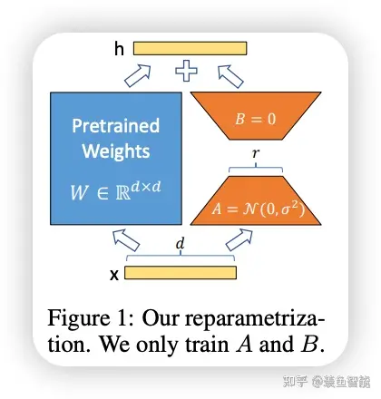

.. _LoRA 原理:

LoRA (Low-Rank Adaptation) 原理
================================================================================

LoRA的全称是 Low-Rank Adaptation，即大型语言模型的低阶自适应，是是微软的研究人员为了解决大语言模型微调而开发的一项技术。 LoRA 算法是 `PEFT: Parameter-Efficient Fine-Tuning <https://github
.com/huggingface/peft>`_ （参数高效性微调方法）的一种。LoRA 主要解决 GPT3 大语言模型做微调成本太高的问题。

LoRA 的具体做法是冻结预训练好的模型（也称作基底模型，如 SD 模型
）权重参数，然后在每个Transformer（Transforme就是GPT的那个T, 是大语言模型的基础组成单元）块里注入可训练的层，由于不需要对模型的权重参数重新计算梯度，大大减少了需要训练的计算量。

LoRA 本来是给大语言模型准备的，但把它用在cross-attention layers（交叉关注层）也能影响用文字生成图片的效果。最早的 Stable Diffusion 模型其实不支持 
LoRa 的，后来才加入了对LoRa的支持，据说，Simo Ryu是第一个让Stable Diffusion支持LoRa的人，见 `lora git repo <https://github.com/cloneofsimo/lora>`_。

LoRA 的具体做法：

1. 在原模型旁边增加一个旁路，通过低秩分解（先降维再升维）来模拟参数的更新量；
#. 训练时，原模型固定 :math:`W_0` ，只训练降维矩阵 :math:`A` 和升维矩阵 :math:`B` ；
#. 推理时，可将 :math:`A B` 加到原参数上，不引入额外的推理延迟；
#. 初始化，:math:`A` 采用高斯分布初始化，:math:`B` 初始化为全0，保证训练开始时旁路 :math:`W_1 = AB` 为0矩阵；
#. 可插拔式的切换任务，当前任务 :math:`W_0+A_1B_1`，将lora部分减掉，换成 :math:`A_2B_2`，即可实现任务切换；

假设预训练的矩阵为 :math:`W_0 \in \mathbb{R}^{d \times k}` , 其更新过程可表示为：

:math:`W_0 + \Delta W = W_0 + AB, A \in \mathbb{R}^{d \times r}, B \in \mathbb{R}^{r \times k}.`

其中秩 :math:`r << min(d, k)`.

前向过程中，:math:`W_0` 和 :math:`\Delta W` 都会乘以相同的输入 x，最后相加

:math:`h=W_0 x + \Delta W x = W_0 x + AB x`

推理过程中只需要把改变量放回元模型，就不会有任何问题：

:math:`W = W_0 + AB`

