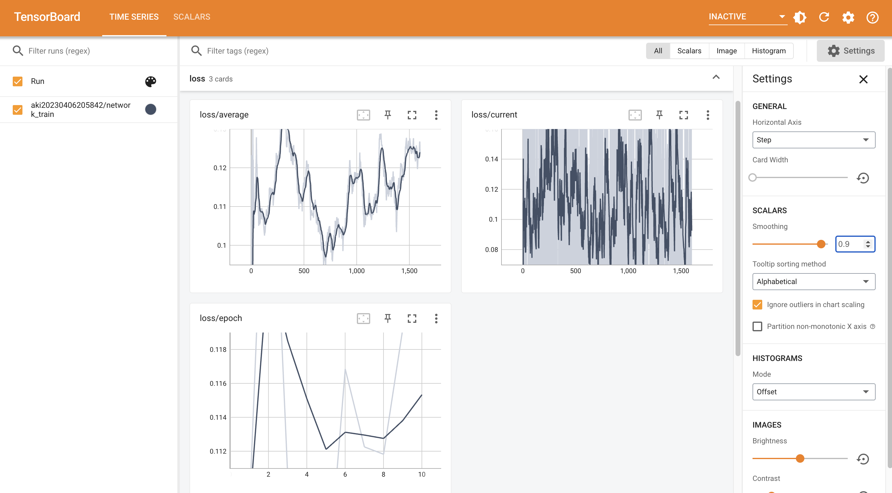

.. _LoRA 模型训练:

LoRA 模型训练
================================================================================

1. 训练前准备
--------------------------------------------------------------------------------

1.1 训练脚本
^^^^^^^^^^^^^^^^^^^^^^^^^^^^^^^^^^^^^^^^^^^^^^^^^^^^^^^^^^^^^^^^^^^^^^^^^^^^^^^^

LoRA 训练过程依赖于以下两个 Git repo

1. `Akegarasu/lora-scripts <https://github.com/Akegarasu/lora-scripts>`_
#. `kohya-ss/sd-scripts <https://github.com/kohya-ss/sd-scripts>`_

1.2 标记数据集
^^^^^^^^^^^^^^^^^^^^^^^^^^^^^^^^^^^^^^^^^^^^^^^^^^^^^^^^^^^^^^^^^^^^^^^^^^^^^^^^

2. 环境安装
--------------------------------------------------------------------------------

2.1 Ubuntu LoRA 训练环境安装
^^^^^^^^^^^^^^^^^^^^^^^^^^^^^^^^^^^^^^^^^^^^^^^^^^^^^^^^^^^^^^^^^^^^^^^^^^^^^^^^

1. 下载源代码

.. code:: bash

    git clone --recurse-submodules https://github.com/Akegarasu/lora-scripts
    
.. Attention:: kohya-ss/sd-scripts 会作为 Submodule 下载在 sd-scripts 文件夹内, 无需额外下载。

2. 安装，在 lora-scripts 路径下执行

.. code:: bash

    ./install.bash

.. Attention::

    1. 该命令会在 lora-scripts 创建 Python venv 环境并激活
    #. 在激活的 Python 虚拟环境中安装 lora-scripts 和 sd-scripts 的相关依赖
    #. 安装过程中会下载 torch 的相关文件，该文件比较大，有可能网络中断，删除 venv 文件后重试即可
    #. 后续操作需要先激活 Python虚拟环境，使用命令：'source venv/bin/activate'

2.2 Win LoRA 训练环境安装
^^^^^^^^^^^^^^^^^^^^^^^^^^^^^^^^^^^^^^^^^^^^^^^^^^^^^^^^^^^^^^^^^^^^^^^^^^^^^^^^

1. 下载源代码

.. code:: bash

    git clone --recurse-submodules https://github.com/Akegarasu/lora-scripts
    
.. Attention:: kohya-ss/sd-scripts 会作为 Submodule 下载在 sd-scripts 文件夹内, 无需额外下载。

2. 安装，PowerShell 打开 lora-scripts 路径，然后执行

.. code:: bash

    ./install.ps1
    
.. Attention::

    1. 在 lora-scripts 路径下会创建 Python 虚拟环境，存放在 venv 文件夹中
    #. 后续操作需要先激活该虚拟环境，使用命令：'.\venv\Scripts\activate'

3. 模型训练
--------------------------------------------------------------------------------

3.1 训练参数说明
^^^^^^^^^^^^^^^^^^^^^^^^^^^^^^^^^^^^^^^^^^^^^^^^^^^^^^^^^^^^^^^^^^^^^^^^^^^^^^^^

3.2 Ubuntu LoRA 模型训练
^^^^^^^^^^^^^^^^^^^^^^^^^^^^^^^^^^^^^^^^^^^^^^^^^^^^^^^^^^^^^^^^^^^^^^^^^^^^^^^^

1. 激活 Python 虚拟环境

.. code:: bash

    source venv/bin/activate
    
2. 编辑 train.sh 文件，然后执行

.. code:: bash

    ./train.sh

3. 在模型训练过程中或者结束后，都可以运行 tensorboard 命令，然后在浏览器中查看训练效果

.. code:: bash

    source venv/bin/activate
    tensorboad --logdir=./logs --port=8888

3.3 Win LoRA 模型训练
^^^^^^^^^^^^^^^^^^^^^^^^^^^^^^^^^^^^^^^^^^^^^^^^^^^^^^^^^^^^^^^^^^^^^^^^^^^^^^^^

1. 编辑 train.sh 文件，然后执行

.. code:: bash

    ./train.ps1

.. Attention::

    1. train.ps1 只是把多组命令行命令包装起来
    #. train.ps1 中自动激活对应的 Python 环境

2. 在模型训练过程中或者结束后，都可以运行 tensorboard 命令，然后在浏览器中查看训练效果

.. code:: bash

    source venv/bin/activate
    tensorboad --logdir=./logs --port=8888

