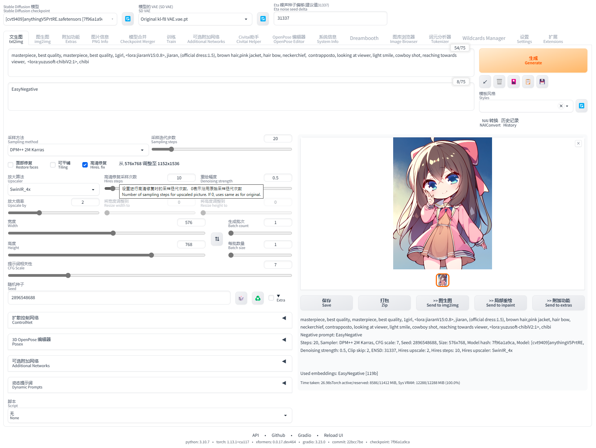

.. _Bilingual:

Bilingual Localization
================================================================================

Bilingual Localization 提供界面的中英文对照显示

1. 安装插件

.. code:: bash

    git clone https://github.com/journey-ad/sd-webui-bilingual-localization extensions/sd-webui-bilingual-localization
    
2. 配置
    - 设置 Settings - User interface - Localization 为 None
    - 在 Settings - Bilingual Localization 面板, 选择本地化文件, 点击 Apply settings and Reload UI 按钮.